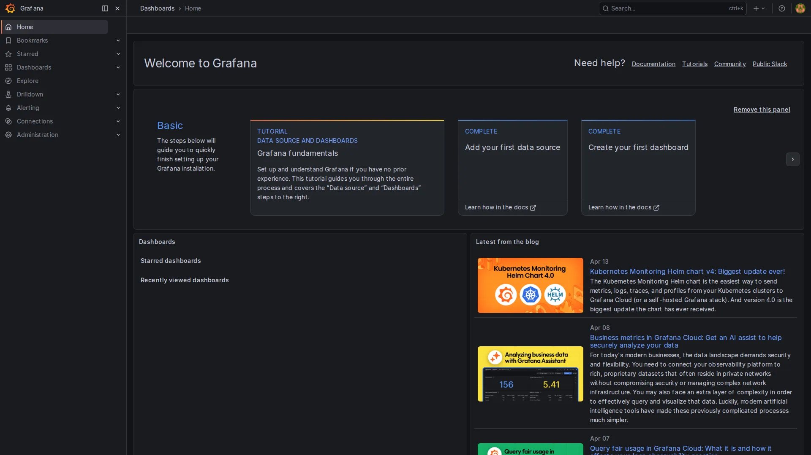
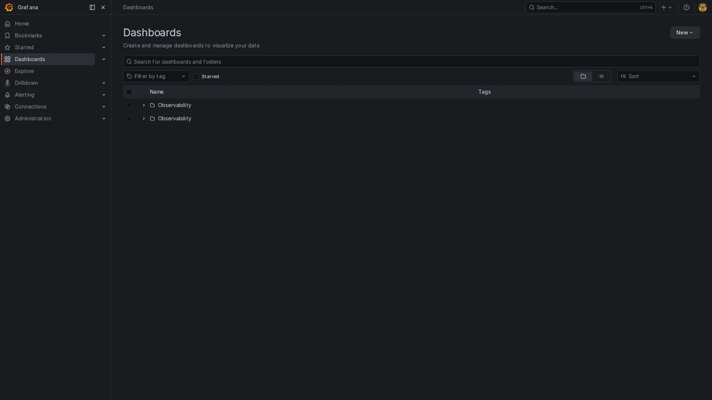
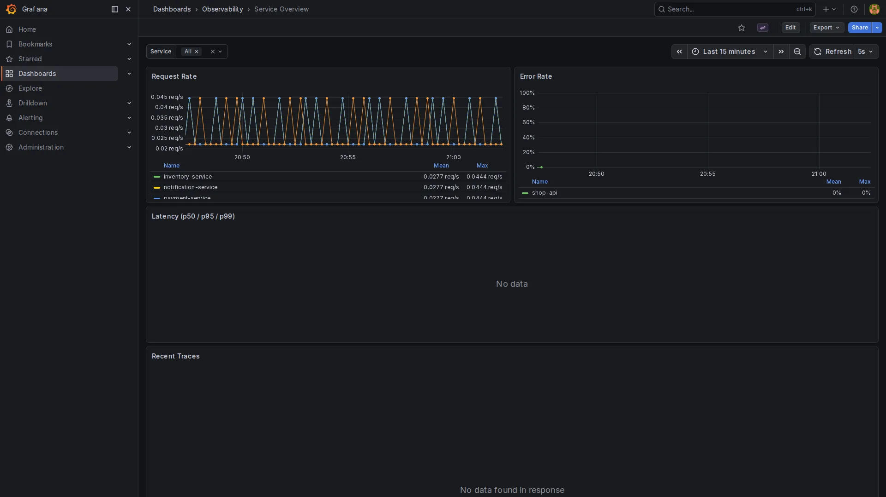
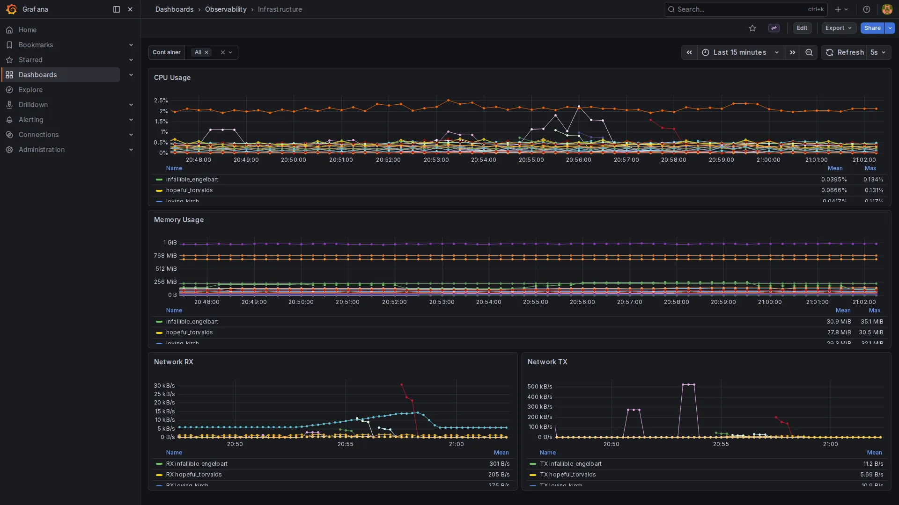
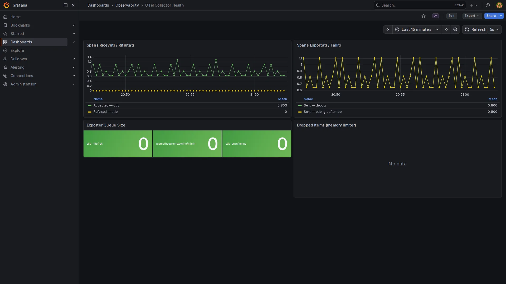
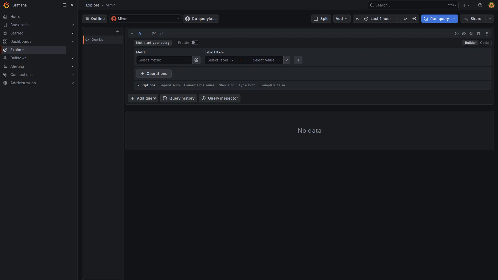
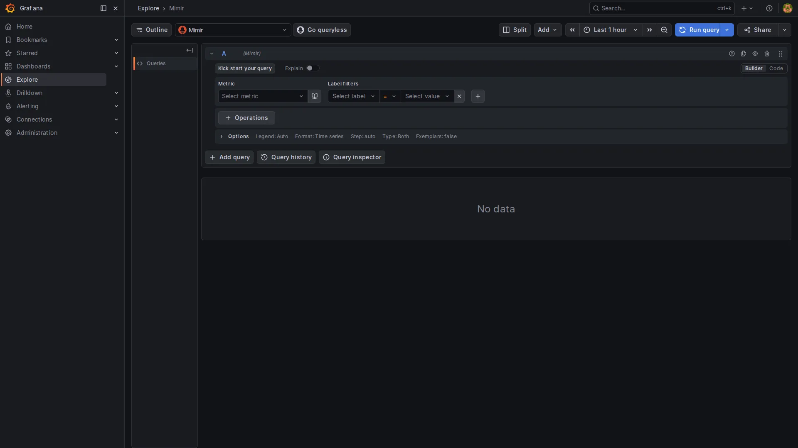
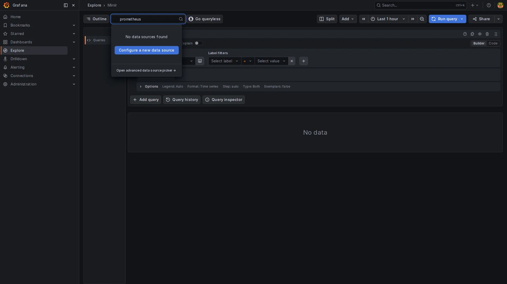
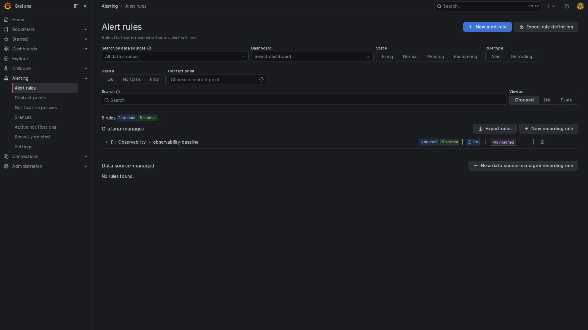

# Grafana: Dashboards and Navigation

This guide explains how to navigate Grafana, understand the three pre-configured dashboards, and use Explore for ad-hoc queries.

## Access

Open [http://localhost:3000](http://localhost:3000) in your browser.

Default credentials: `admin` / `admin` (or the values set in your `.env` file).

Grafana loads directly to the home page with the available dashboards.



---

## Pre-loaded Dashboards

The stack includes three dashboards already configured and accessible from the Grafana home.

To open a dashboard: click **Dashboards** in the left sidebar, then select the name from the list.



### 1. Service Overview

**Path:** `Dashboards → Service Overview`

Shows RED metrics (Rate, Errors, Duration) for each instrumented service. Metrics are generated automatically by Tempo via span-metrics — no additional SDK configuration required.

**Panels:**

| Panel | Description |
|-------|-------------|
| Request Rate | Requests per second per service (SPAN_KIND_SERVER) |
| Error Rate | Percentage of spans with errors |
| Duration (p50/p95/p99) | Latency percentiles per service |
| Top Slow Operations | Operations with the highest average latency |

**`$service` variable:** a dropdown at the top left lets you filter data by a single service or view all together.



### 2. Infrastructure

**Path:** `Dashboards → Infrastructure`

Shows resource usage for running Docker containers. Data comes from the `docker_stats` receiver in the OTel Collector, which reads `/var/run/docker.sock`.

**Panels:**

| Panel | Description |
|-------|-------------|
| CPU Usage | CPU usage per container |
| Memory Usage | Memory used vs. limit |
| Network I/O | Inbound/outbound network traffic |
| Disk I/O | Read/write disk operations |



### 3. OTel Collector Health

**Path:** `Dashboards → OTel Collector Health`

Monitors the internal state of the Collector: how many metrics/logs/traces it receives, processes, and exports. Useful for diagnosing blocked pipelines or ingestion drops.

**Panels:**

| Panel | Description |
|-------|-------------|
| Received / Accepted / Refused | Incoming data by type (metrics, logs, traces) |
| Exported | Data successfully sent to backends |
| Queue Size | Export queue size |
| Exporter Errors | Connection errors to Loki/Tempo/Mimir |



---

## Explore: Ad-hoc Queries

**Explore** is the tool for ad-hoc queries outside of dashboards. Open it from the left sidebar → compass icon → **Explore**.

Select the datasource in the top left:

| Datasource | Data type | Query language |
|------------|-----------|----------------|
| **Loki** | Logs | LogQL |
| **Tempo** | Traces | TraceQL |
| **Mimir** | Metrics | PromQL |

### Example: search logs for a service

1. Open Explore and select **Loki** as the datasource.
2. In the query field enter:

   ```logql
   {service_name="my-service"}
   ```

3. Click **Run query** (or press `Shift+Enter`).



Logs appear in reverse chronological order. You can further filter by log level:

```logql
{service_name="my-service"} |= "ERROR"
```

### Example: find a trace by ID

1. Open Explore and select **Tempo** as the datasource.
2. Select the **TraceID** mode at the top.
3. Paste the Trace ID in the input field and click **Run query**.

Or use **Search** to query by service name and span name:



```traceql
{ resource.service.name = "my-service" && status = error }
```

### Example: PromQL query on Mimir

1. Open Explore and select **Mimir** as the datasource.
2. In the query field enter:

   ```promql
   sum(rate(traces_spanmetrics_calls_total{span_kind="SPAN_KIND_SERVER"}[5m])) by (service)
   ```

3. Click **Run query**.



---

## Signal Correlation

Grafana lets you jump between logs, traces, and metrics without losing context.

### Logs to traces

If your logs contain a `trace_id` field, Grafana shows a clickable link that opens the corresponding trace directly in Tempo. This works because the Loki datasource has a **Derived Field** configured for `trace_id` → link to Tempo (already configured in this stack).

### Metrics to traces (Exemplars)

If you send exemplars with your metrics, you can click a point on a PromQL graph to open the corresponding trace in Tempo. Exemplars must be enabled in your application's SDK.

---

## Alerts

Alert rules are pre-configured in `grafana/provisioning/alerting/rules.yaml` and activate automatically. To view them:

**Path:** `Alerting → Alert rules`



Pre-configured rules monitor:

| Rule | Condition |
|------|-----------|
| High Error Rate | Error rate > 5% for 5 minutes |
| High Latency | p99 latency > 1s for 5 minutes |
| Service Down | No data received for 2 minutes |
| Collector Unhealthy | Exporter errors > 0 |
| Collector Queue Full | Queue size > 80% of the limit |

To customize thresholds and notification channels: [ALERTING.md](ALERTING.md)

---

## Useful Shortcuts

| Shortcut | Action |
|----------|--------|
| `Ctrl+S` | Save dashboard |
| `Shift+Enter` | Run query in Explore |
| `d d` | Go to dashboards home |
| `e` | Open a panel in edit mode |
| `p i` | Inspect panel (raw data) |
| `t a` | Toggle annotations |
