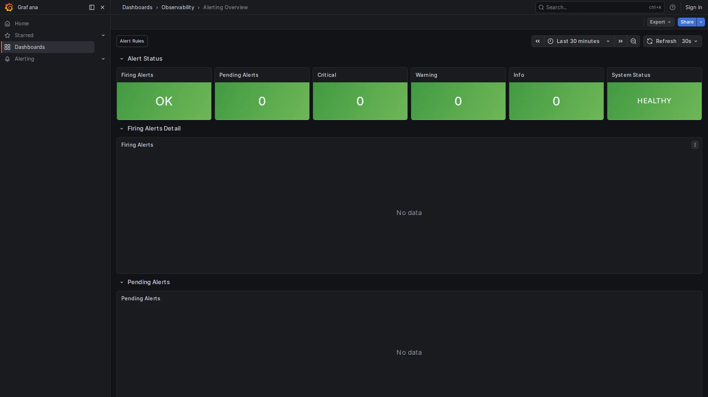

# Alerting Overview

**Path:** `Dashboards → Observability → Alerting Overview`  
**Datasource:** Mimir (PromQL)  
**Refresh:** 30s  
**Tags:** `alerting`, `observability`

## Purpose

The Alerting Overview shows the current state of all Grafana alert rules at a glance. It provides a severity breakdown (critical / warning / info) and detailed tables of currently firing and pending alerts.

This dashboard complements the built-in `Alerting → Alert rules` page with a metric-driven view — useful for embedding in an on-call runbook or a NOC screen.




---

## How Grafana Alerting Works

Grafana evaluates alert rules on a schedule. Each rule has three states:

| State | Meaning |
|-------|---------|
| **Normal** | Condition not met |
| **Pending** | Condition met, waiting for `for` duration |
| **Firing** | Condition met for the full `for` duration — notification sent |

The `ALERTS` metric in Mimir (written by Grafana itself) records firing and pending alerts as time series with labels for alert name, severity, and state.

---

## Panels

### Firing Alerts (stat)
Count of currently firing alerts. Background turns **red** when ≥ 1 alert is firing.

**Query:**
```promql
count(ALERTS{alertstate="firing"}) or vector(0)
```

---

### Pending Alerts (stat)
Count of alerts in `pending` state — their condition is met but has not sustained long enough to fire. Useful for catching problems early.

---

### Critical / Warning / Info (stat cards)
Firing alerts broken down by severity label. The stack's built-in rules use `severity: critical` or `severity: warning`.

---

### System Status (stat)
A single "HEALTHY / DEGRADED" indicator. Shows `DEGRADED` whenever at least one critical alert is firing.

---

### Firing Alerts (table)
Full detail table of all currently firing alerts with columns for alert name, severity, and any additional labels. Use the filter icon to search by alert name.

---

### Pending Alerts (table)
Same layout as the Firing table, but for pending alerts. Pending alerts are early warnings — they may resolve on their own or escalate to firing within `for` duration.

---

## Pre-configured Alert Rules

The following rules are provisioned in `grafana/provisioning/alerting/rules.yaml`:

| Rule | Condition | Severity | `for` |
|------|-----------|----------|-------|
| **High Error Rate** | Error rate > 5% | critical | 5m |
| **High Latency p99** | p99 > 2000ms | warning | 5m |
| **Service Down** | No spans received | critical | 5m |
| **Collector Dropping Spans** | Dropped spans > 0 | warning | 2m |
| **Collector Queue High** | Queue > 80% capacity | warning | 2m |

> **Note:** the **Service Down** alert uses `noDataState: Alerting` — it fires automatically when no span metrics are received, without requiring an explicit condition to be met.

---

## How to Use

1. Open the dashboard with **time range = Last 30 minutes** for a real-time view.
2. If a critical alert is firing, click the alert name in the table and go to `Alerting → Alert rules` for the full rule definition and evaluation history.
3. Use the **Traces Explorer** or **Logs Explorer** to investigate the root cause.
4. To add notification channels (Slack, email, PagerDuty): see [ALERTING.md](../ALERTING.md).

---

## Silencing an Alert

To silence a firing alert during maintenance:

1. Go to `Alerting → Silences → Add silence`.
2. Match the alert by label (e.g., `alertname="High Error Rate"`).
3. Set the duration and add a comment.

Silences suppress notifications but the alert remains visible in this dashboard.

## Related Dashboards

- [Service Overview](service-overview.md) — source of the High Error Rate and High Latency metrics
- [OTel Collector Health](otel-collector-health.md) — source of the Collector Dropping / Queue alerts
- [SLO Dashboard](slo-dashboard.md) — measure the impact of a firing alert on the error budget
