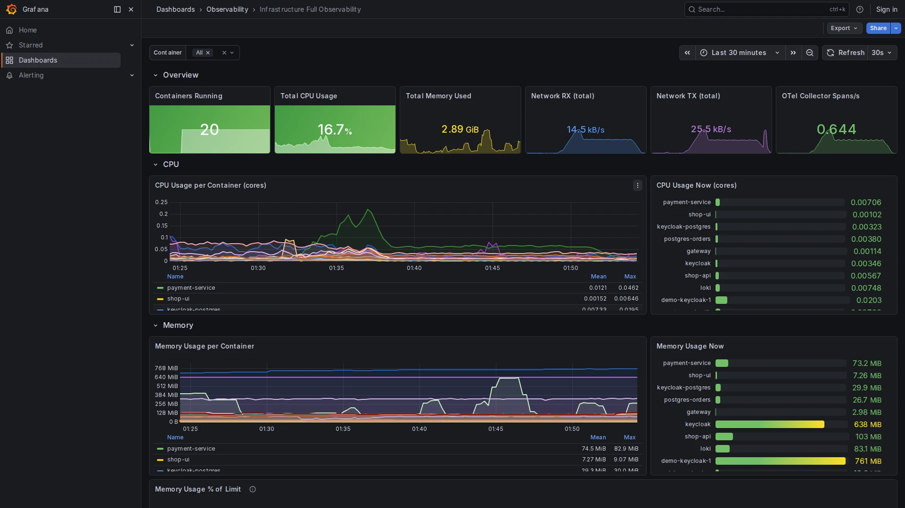

# Infrastructure Full Observability

**Path:** `Dashboards → Observability → Infrastructure Full Observability`  
**Datasource:** Mimir (PromQL)  
**Refresh:** 30s  
**Tags:** `infrastructure`, `docker`, `observability`, `otel`

## Purpose

A comprehensive infrastructure view covering CPU, memory, network, Block I/O, and OTel Collector internals — all in a single dashboard. Extends the compact [Infrastructure](infrastructure.md) dashboard with bar gauges, a summary table, and a dedicated section for the OTel Collector pipeline.

---

## Variables

| Variable | Source | Description |
|----------|--------|-------------|
| `$container` | `label_values(container_memory_usage_total_bytes, container_name)` | Multi-select container filter. Defaults to `All`. |

---

## Sections

### Overview (stat cards)

| Card | Metric | Notes |
|------|--------|-------|
| Containers Running | `count(container_memory_usage_total_bytes)` | Number of active containers |
| Total CPU Usage | sum of `rate(...nanoseconds_total) / 1e9` | Total cores across all containers |
| Total Memory Used | sum of `container_memory_usage_total_bytes` | Aggregate memory footprint |
| Network RX | sum of `rate(...rx_bytes_total)` | Total inbound bytes/s |
| Network TX | sum of `rate(...tx_bytes_total)` | Total outbound bytes/s |
| OTel Spans/s | `sum(rate(otelcol_receiver_accepted_spans_total))` | Quick health indicator for the collector |

---

### CPU

- **Time series:** CPU usage per container over time (in CPU-cores).
- **Bar gauge:** current CPU usage per container — instantly shows which container is the hottest.

---

### Memory

- **Time series:** memory usage per container over time.
- **Bar gauge:** current memory per container.
- **Memory % of Limit:** ratio of `usage / limit` — only populated for containers with a memory limit configured. Reaching 100% causes an OOM kill.

---

### Network

- **RX / TX time series:** throughput per container.
- **Network Errors:** RX and TX error counters — normally zero; non-zero values indicate a network issue at the container or host level.

---

### Block I/O

Read and write throughput from `container_blockio_io_service_bytes_recursive_total` broken down by `operation` label (`read` / `write`). Useful for identifying containers doing heavy disk I/O (e.g., databases, log-heavy services).

---

### Container Summary Table

A snapshot table with one row per container showing current CPU, memory, RX, and TX values. Sort by any column to rank containers by resource consumption.

---

### OTel Collector Health

| Panel | Metric | Description |
|-------|--------|-------------|
| Spans Accepted/s | `otelcol_receiver_accepted_spans_total` | Healthy ingestion rate |
| Spans Dropped/s | `otelcol_processor_dropped_spans_total` | Non-zero = memory_limiter triggered |
| Metrics Points/s | `otelcol_receiver_accepted_metric_points_total` | Metric throughput |
| Log Records/s | `otelcol_receiver_accepted_log_records_total` | Log throughput |
| Throughput (time series) | All four signals over time | Detect pipeline imbalances |
| Collector Memory | RSS + heap alloc | Detect memory leaks or OOM risk |
| Exporter Queue Fill % | `queue_size / queue_capacity` | > 80% triggers the Collector Queue High alert |

---

## How to Use

1. Start with the **Overview stat cards** to get a snapshot of overall health.
2. Drill into the **CPU / Memory** sections to identify hot containers.
3. Check the **OTel Collector Health** section if metrics or traces are missing — a full queue or high drop rate means the collector is overloaded.
4. Use the **Container Summary Table** to compare containers at a glance.

## Related Dashboards

- [Infrastructure](infrastructure.md) — compact version without Block I/O and Collector health
- [OTel Collector Health](otel-collector-health.md) — detailed Collector dashboard with per-pipeline breakdown
- [Alerting Overview](alerting-overview.md) — Collector alerts (dropping spans, queue full) appear here
