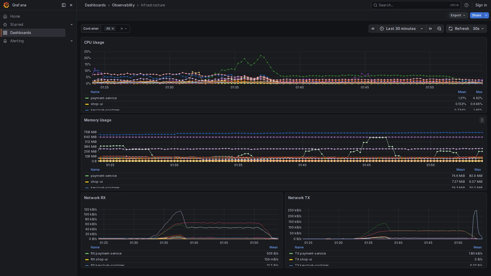

# Infrastructure

**Path:** `Dashboards → Observability → Infrastructure`  
**Datasource:** Mimir (PromQL)  
**Refresh:** 30s  
**Tags:** `observability`, `infrastructure`, `docker`

## Purpose

The Infrastructure dashboard shows resource usage for all running Docker containers. Data is collected by the OTel Collector's `docker_stats` receiver, which reads `/var/run/docker.sock` every 15 seconds and forwards metrics to Mimir.

This is the compact version of the infrastructure view. For a more complete picture including Block I/O and OTel Collector internals, see [Infrastructure Full Observability](infra-full-observability.md).




---

## Variables

| Variable | Source | Description |
|----------|--------|-------------|
| `$container` | `label_values(container_memory_usage_total_bytes, container_name)` | Multi-select container filter. Defaults to `All`. |

---

## Panels

### CPU Usage
**Query:**
```promql
rate(container_cpu_usage_nanoseconds_total{container_name=~"$container"}[$__rate_interval]) / 1e9
```
CPU usage in CPU-cores (1.0 = one full core). The `docker_stats` receiver reports cumulative nanoseconds; dividing by 1e9 converts to cores-per-second.

---

### Memory Usage
**Query:**
```promql
container_memory_usage_total_bytes{container_name=~"$container"}
```
RSS + cache memory in bytes. For containers with a memory limit set, compare against `container_memory_total_bytes` to see how close they are to the OOM threshold.

---

### Network RX / TX
**Queries:**
```promql
rate(container_network_io_usage_rx_bytes_total{container_name=~"$container"}[$__rate_interval])
rate(container_network_io_usage_tx_bytes_total{container_name=~"$container"}[$__rate_interval])
```
Inbound and outbound network throughput in bytes/s.

---

## Available Metrics

The `docker_stats` receiver exposes the following metrics (all prefixed `container_`):

| Metric | Description |
|--------|-------------|
| `container_cpu_usage_nanoseconds_total` | Cumulative CPU time |
| `container_cpu_utilization_ratio` | CPU % (0–1, relative to host) |
| `container_memory_usage_total_bytes` | Memory used |
| `container_memory_total_bytes` | Memory limit (if set) |
| `container_network_io_usage_rx_bytes_total` | Network received |
| `container_network_io_usage_tx_bytes_total` | Network sent |
| `container_network_io_usage_rx_errors_total` | Network RX errors |
| `container_network_io_usage_tx_errors_total` | Network TX errors |
| `container_blockio_io_service_bytes_recursive_total` | Block I/O (by operation) |

---

## How to Use

1. Use the `$container` dropdown to focus on specific containers.
2. Set the time range to the period of interest.
3. Identify which container is consuming the most CPU or memory.
4. Correlate resource spikes with the **Service Overview** to check if latency increased at the same time.

## Related Dashboards

- [Infrastructure Full Observability](infra-full-observability.md) — extends this with Block I/O, bar gauges, and OTel Collector health
- [OTel Collector Health](otel-collector-health.md) — check if a resource spike is caused by the collector itself
- [Service Overview](service-overview.md) — correlate container load with application latency
