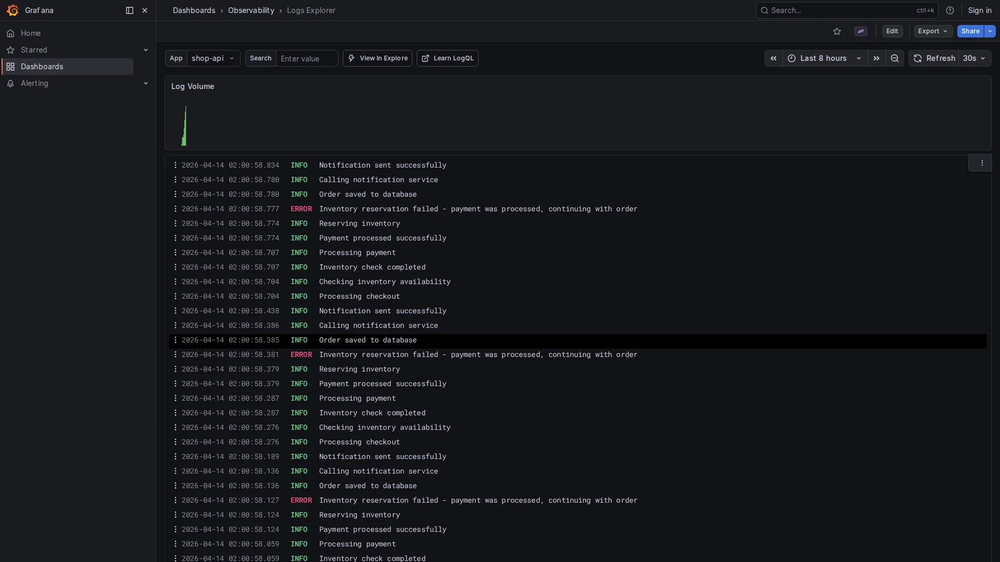

# Logs Explorer

**Path:** `Dashboards → Observability → Logs Explorer`  
**Datasource:** Loki  
**Refresh:** 30s  
**Tags:** `loki`, `logs`, `observability`

## Purpose

The Logs Explorer provides a log viewer for all services sending logs via OTLP. It allows full-text search across log lines and shows a bar chart of log volume over time.




---

## Variables

| Variable | Source | Description |
|----------|--------|-------------|
| `$app` | `label_values(job)` | Select which service's logs to show |
| `$search` | Text input | Full-text filter applied to every log line |

---

## Panels

### Log Volume (bar chart)
**Query:**
```logql
sum(count_over_time({job="$app"} |= "$search" [$__interval]))
```
Shows how many log lines match the current filter per time bucket. A spike here often indicates a cascade of errors.

---

### Log Lines
**Query:**
```logql
{job="$app"} |= "$search"
```
Live log viewer with newest lines at the top. Clicking any log line expands the full structured fields (labels, trace_id, level, etc.).

---

## How to Use

1. Select the **service** from the `$app` dropdown.
2. Type a keyword in **Search** to filter log lines (e.g., `ERROR`, `timeout`, `checkout`).
3. Set the **time range** to the window of interest.
4. Click a log line to expand the full log entry and see associated labels.

### From log to trace

If the application includes a `trace_id` field in its logs, Grafana shows a **Tempo** link next to the log line. Clicking it opens the corresponding distributed trace in the Explore view.

> **Requirement:** the OTel SDK must propagate the trace context into the log record (e.g., via `go.opentelemetry.io/otel/bridge/log` or the Java/Python bridge).

---

## Useful LogQL Queries

Filter errors only:
```logql
{job="shop-api"} |= "ERROR"
```

Filter by HTTP status code:
```logql
{job="shop-api"} | json | status >= 500
```

Count errors per minute:
```logql
sum(count_over_time({job="shop-api"} |= "ERROR" [1m]))
```

Show only checkout-related logs:
```logql
{job="shop-api"} |= "checkout"
```

## Related Dashboards

- [Traces Explorer](traces-explorer.md) — find the trace corresponding to an error log
- [Service Overview](service-overview.md) — correlate log volume spikes with error rate
- [Alerting Overview](alerting-overview.md) — check if the log spike triggered an alert
