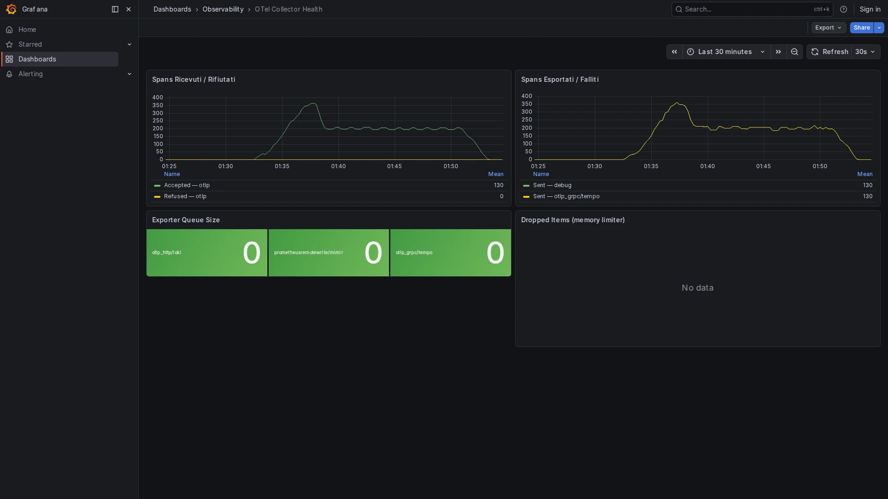

# OTel Collector Health

**Path:** `Dashboards → Observability → OTel Collector Health`  
**Datasource:** Mimir (PromQL)  
**Refresh:** 30s  
**Tags:** `collector-health`, `observability`, `otel`

## Purpose

Monitors the internal state of the OpenTelemetry Collector: how much telemetry it receives, how much it processes and exports, and where it drops data. This is the primary tool for diagnosing missing metrics, logs, or traces.




---

## How the Collector Exposes Metrics

The Collector scrapes its own internal metrics via the `prometheus/self` receiver (configured in `otel-collector/config.yaml`) and forwards them to Mimir via the `metrics/infra` pipeline. All metrics are prefixed `otelcol_`.

---

## Panels

### Received / Accepted / Refused

The Collector distinguishes between:

| Metric suffix | Meaning |
|---------------|---------|
| `_received_` | Data arriving at a receiver before any validation |
| `_accepted_` | Data successfully passed to the pipeline |
| `_refused_` | Data rejected (e.g., malformed OTLP payload) |

**Queries:**
```promql
sum(rate(otelcol_receiver_accepted_spans_total[$__rate_interval]))
sum(rate(otelcol_receiver_accepted_metric_points_total[$__rate_interval]))
sum(rate(otelcol_receiver_accepted_log_records_total[$__rate_interval]))
```

---

### Exported

Data successfully sent to backends (Loki, Tempo, Mimir). A gap between `accepted` and `exported` indicates data is being dropped somewhere in the pipeline.

```promql
sum(rate(otelcol_exporter_sent_spans_total[$__rate_interval]))
sum(rate(otelcol_exporter_sent_metric_points_total[$__rate_interval]))
sum(rate(otelcol_exporter_sent_log_records_total[$__rate_interval]))
```

---

### Dropped Spans

```promql
sum(rate(otelcol_processor_dropped_spans_total[$__rate_interval]))
```

A non-zero value here means the `memory_limiter` processor is rejecting data because the Collector is approaching its memory limit (default: 512 MiB). The **Collector Dropping Spans** alert fires when this is > 0 for 2 minutes.

**Fix:** increase `limit_mib` in `otel-collector/config.yaml` or reduce the ingestion rate.

---

### Queue Size

```promql
otelcol_exporter_queue_size / otelcol_exporter_queue_capacity
```

The export queue buffers data before it is sent to backends. A consistently high fill ratio (> 80%) means the backends cannot absorb data fast enough. The **Collector Queue High** alert fires at 80%.

---

### Exporter Errors

Connection errors to Loki, Tempo, or Mimir. A spike here usually means one of the backends is down or unreachable.

---

## Common Issues

| Symptom | Likely cause | What to check |
|---------|-------------|---------------|
| Spans/metrics/logs missing in Grafana | Backend unreachable | Exporter errors panel |
| `otelcol_processor_dropped_*` > 0 | Memory limit hit | Increase `limit_mib` |
| Queue fill > 80% | Backend slow | Backend health, network latency |
| `accepted` = 0 | No data arriving | Is your app sending to port 4317/4318? |
| `refused` > 0 | Malformed OTLP | Check app SDK configuration |

---

## How to Use

1. When traces or metrics are missing from other dashboards, open this dashboard first.
2. Check if `accepted` > 0 — if not, the problem is upstream (app not sending data).
3. Check if `exported` ≈ `accepted` — a gap means the collector is dropping or buffering.
4. Check the **Queue Size** and **Exporter Errors** panels to narrow down the cause.

## Related Dashboards

- [Infrastructure Full Observability](infra-full-observability.md) — includes an OTel Collector section with resource usage
- [Alerting Overview](alerting-overview.md) — Collector alerts appear here when thresholds are breached
