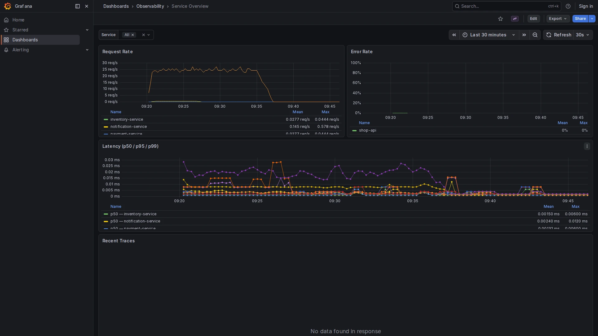

# Service Overview

**Path:** `Dashboards → Observability → Service Overview`  
**Datasource:** Mimir (PromQL)  
**Refresh:** 30s  
**Tags:** `observability`, `otel`, `red-metrics`

## Purpose

The Service Overview dashboard shows **RED metrics** (Rate, Errors, Duration) for each instrumented service. Metrics are generated automatically by Tempo's `metrics-generator` via the `span_metrics` processor — no additional SDK configuration is required beyond sending traces.




---

## Variables

| Variable | Source | Description |
|----------|--------|-------------|
| `$service` | `label_values(traces_spanmetrics_calls_total, service)` | Filter by service name. Supports `All` to aggregate across all services. |

---

## Panels

### Request Rate
**Query:**
```promql
sum by(service) (
  rate(traces_spanmetrics_calls_total{
    service=~"$service",
    span_kind="SPAN_KIND_SERVER"
  }[$__rate_interval])
)
```
Shows how many server-side spans are processed per second, broken down by service. A drop to zero indicates the service stopped receiving traffic or is not reporting spans.

---

### Error Rate
**Query:**
```promql
sum by(service) (
  rate(traces_spanmetrics_calls_total{
    service=~"$service",
    span_kind="SPAN_KIND_SERVER",
    status_code="STATUS_CODE_ERROR"
  }[$__rate_interval])
)
/
sum by(service) (
  rate(traces_spanmetrics_calls_total{
    service=~"$service",
    span_kind="SPAN_KIND_SERVER"
  }[$__rate_interval])
)
```
Error ratio between 0 and 1. The **High Error Rate** alert fires when this exceeds 5% for more than 5 minutes.

---

### Duration (p50 / p95 / p99)
**Query:**
```promql
histogram_quantile(0.99,
  sum by(le, service) (
    rate(traces_spanmetrics_duration_milliseconds_bucket{
      service=~"$service",
      span_kind="SPAN_KIND_SERVER"
    }[$__rate_interval])
  )
)
```
Latency percentiles in milliseconds. The **High Latency p99** alert fires when p99 exceeds 2000ms for more than 5 minutes.

---

### Top Slow Operations
A table showing the highest-latency operations by span name and service. Useful for identifying which specific endpoint or method is causing latency spikes.

---

## How to Use

1. Open the dashboard and select a **time range** that includes the event you want to investigate (e.g., `Last 30 minutes`).
2. Use the `$service` dropdown to isolate a single service.
3. Correlate an error spike with the **Logs Explorer** or **Traces Explorer** to find the root cause.

## Related Dashboards

- [Traces Explorer](traces-explorer.md) — drill into individual traces for a service
- [SLO Dashboard](slo-dashboard.md) — measure long-term reliability from the same metrics
- [Alerting Overview](alerting-overview.md) — see if any threshold has been breached
