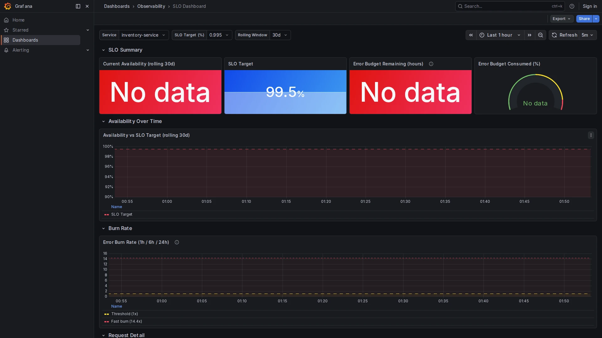

# SLO Dashboard

**Path:** `Dashboards → Observability → SLO Dashboard`  
**Datasource:** Mimir (PromQL)  
**Refresh:** 5m  
**Tags:** `slo`, `observability`, `red-metrics`

## Purpose

The SLO Dashboard measures service reliability over a rolling time window. It tracks **availability** (what % of requests succeeded), **error budget** (how much tolerance remains), and **burn rate** (how fast the budget is being consumed).

All metrics are derived from Tempo span_metrics — no separate instrumentation is needed.




---

## Variables

| Variable | Options | Description |
|----------|---------|-------------|
| `$service` | All services | The service to measure |
| `$slo_target` | 99.9% / 99.5% / 99.0% / 95.0% | The availability target |
| `$window` | 7d / 30d / 28d | Rolling measurement window |

> **Tip:** set the **time range** to match `$window` (e.g., `Last 30 days`) for the availability chart to be meaningful. For a quick post-incident review, set both to `Last 1h` or `Last 6h`.

---

## Panels

### Current Availability
The availability percentage over the selected rolling window. Color coding:
- 🔴 Below 99%
- 🟡 Between 99% and 99.9%
- 🟢 Above 99.9%

**Query:**
```promql
1 - (
  sum(rate(traces_spanmetrics_calls_total{
    service="$service", status_code="STATUS_CODE_ERROR"
  }[$window]))
  /
  sum(rate(traces_spanmetrics_calls_total{service="$service"}[$window]))
)
```

---

### SLO Target
Displays the configured target value from the `$slo_target` variable. Compare against **Current Availability** to see whether the SLO is being met.

---

### Error Budget Remaining (hours)
How many hours of downtime remain within the rolling window before the SLO is breached. Calculated as:

```
remaining_hours = window_hours × (error_budget_fraction - actual_error_rate)
```

For a 99.5% SLO over 30 days: `720h × 0.005 = 3.6h` total budget. If 2h have been consumed, 1.6h remain.

---

### Error Budget Consumed (gauge)
Visual percentage of the error budget already used. Thresholds:
- 🟢 0–50% consumed
- 🟡 50–90% consumed
- 🔴 >90% consumed — SLO is at risk

---

### Availability Over Time
Line chart showing availability vs. the SLO target line over the selected window. The dashed red line is the target. Any dip below it counts against the error budget.

---

### Error Burn Rate (1h / 6h / 24h)
Burn rate measures how fast the error budget is being consumed relative to the allowed rate.

- **Burn rate = 1** means consuming the budget at exactly the sustainable rate (will run out at end of window).
- **Burn rate > 14.4** triggers a fast-burn alert (2h exhaustion of a 30d budget).
- **Burn rate < 1** means the budget is recovering.

The dashed lines show the 1× and 14.4× thresholds.

---

### Request Rate & Errors
Raw request rate and error count over time. Helps identify when errors started and how long they lasted.

---

### Error Ratio
Error percentage over time compared to the error budget limit line. When the bar goes above the limit, the budget starts burning.

---

## Interpreting the Dashboard

| Situation | What you see | Action |
|-----------|-------------|--------|
| Normal operation | Availability ≥ target, budget > 50%, burn rate ≈ 1 | None |
| Incident in progress | Burn rate spike, availability dipping | Investigate via Traces Explorer / Logs Explorer |
| Budget nearly exhausted | Gauge > 90%, remaining < 1h | Consider a feature freeze or rollback |
| Budget recovered | Availability back above target, burn rate < 1 | Write a postmortem |

## Related Dashboards

- [Service Overview](service-overview.md) — real-time RED metrics that feed this dashboard
- [Alerting Overview](alerting-overview.md) — the High Error Rate alert is linked to the same metrics
- [Traces Explorer](traces-explorer.md) — find the traces responsible for SLO violations
