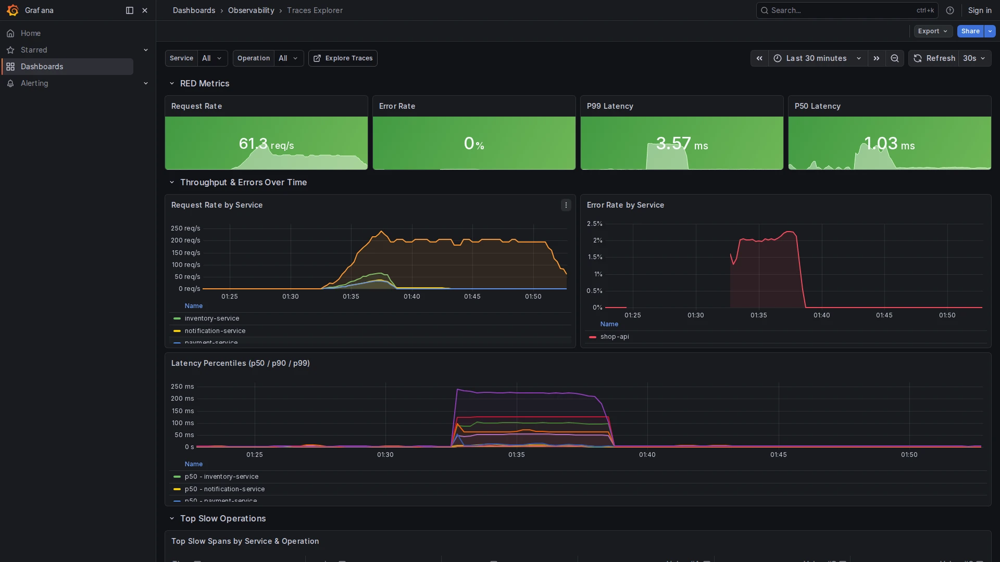

# Traces Explorer

**Path:** `Dashboards → Observability → Traces Explorer`  
**Datasources:** Mimir (PromQL), Tempo  
**Refresh:** 30s  
**Tags:** `tempo`, `traces`, `otel`, `observability`, `red-metrics`

## Purpose

The Traces Explorer combines aggregated RED metrics (from Tempo span_metrics) with a native trace search panel. It lets you move from high-level latency trends down to individual request traces without switching tools.




---

## Prerequisites

Tempo must have the `metrics-generator` enabled with the `span_metrics` and `service_graphs` processors. These are already configured in this stack (`tempo/config.yaml`). The generated metrics flow into Mimir via remote_write.

---

## Variables

| Variable | Source | Description |
|----------|--------|-------------|
| `$service` | `label_values(traces_spanmetrics_calls_total, service)` | Filter by service. Supports `All`. |
| `$span_name` | `label_values(...{service=~"$service"}, span_name)` | Filter by operation name within the selected service. |

---

## Panels

### RED Metrics (stat cards)

Four summary cards at the top showing the current values for the selected service:

| Card | Metric | Threshold |
|------|--------|-----------|
| Request Rate | `traces_spanmetrics_calls_total` | — |
| Error Rate | ratio of `STATUS_CODE_ERROR` spans | 🟡 1% · 🔴 5% |
| P99 Latency | `traces_spanmetrics_duration_milliseconds_bucket` p99 | 🟡 500ms · 🔴 1s |
| P50 Latency | same, p50 | 🟡 100ms · 🔴 500ms |

---

### Request Rate by Service (time series)
Throughput per service over time. Use this to identify when a traffic surge started.

---

### Error Rate by Service (time series)
Error ratio per service. Compare with the log volume in **Logs Explorer** to correlate spikes.

---

### Latency Percentiles p50 / p90 / p99 (time series)
All three percentiles on the same chart. A widening gap between p50 and p99 indicates that a subset of requests are slow — typical of a cold-start or database lock.

---

### Top Slow Spans (table)
A ranked table of operations by p99 latency, with columns for rate and error rate. Sort by **P99 Latency** to find the slowest operations.

---

### Search Traces (Tempo panel)
Native trace search powered by the Tempo datasource. Filter by service name, span name, minimum/maximum duration, and arbitrary tags.

**Example searches:**

Find all error traces for a service:
```traceql
{ resource.service.name = "payment-service" && status = error }
```

Find slow traces (>500ms):
```traceql
{ resource.service.name = "shop-api" && duration > 500ms }
```

Find traces with a specific HTTP route:
```traceql
{ span.http.route = "/api/checkout" }
```

---

## How to Use

1. Select a **service** and narrow the **time range** to the incident window.
2. Look at the **error rate** and **p99 latency** charts to identify the time of the spike.
3. Use the **Top Slow Spans** table to find which operation was responsible.
4. Open the **Search Traces** panel, filter by service and duration, and click a trace to inspect the full span tree.

## Related Dashboards

- [Logs Explorer](logs-explorer.md) — jump from a trace's `trace_id` to the associated logs
- [Service Overview](service-overview.md) — same RED metrics with a simpler layout
- [SLO Dashboard](slo-dashboard.md) — long-term availability from the same trace data
